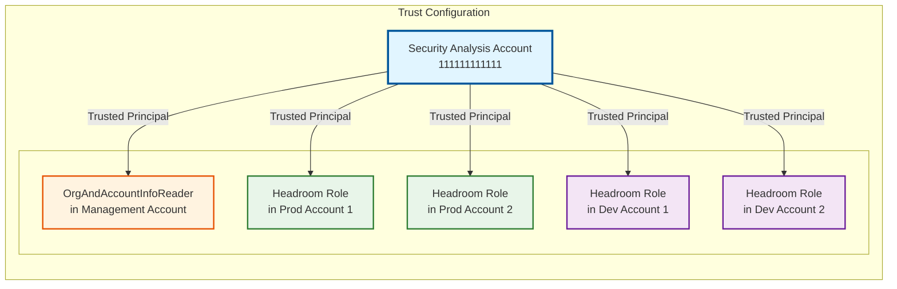
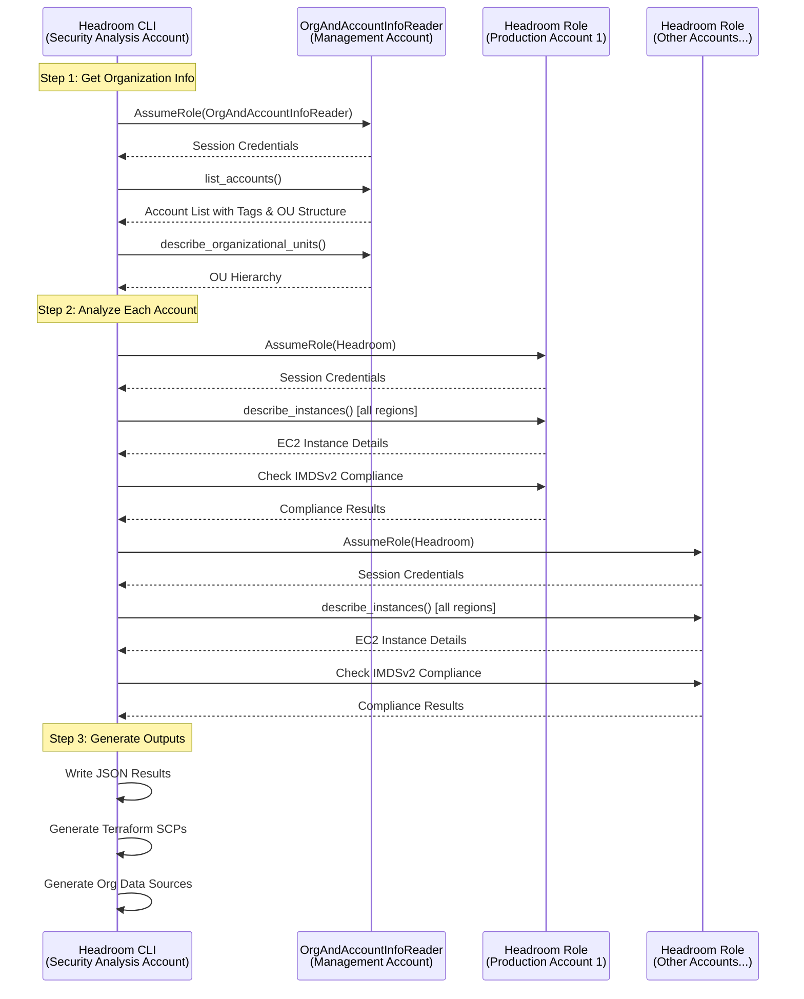

# Headroom (proof-of-concept, currently)

## About
Bring down the ceiling on your AWS environment via a bare-bones prevention-focused CLI tool.


Ever want audit mode for SCPs / RCPs? Now you can have SCPs/RCPs auto-generated where they will not be disruptive, and an exact list violations where they will.

This tool will provide systematic means of:

1. Preventing new violations at the broadest level (think: [root > OU > account](https://docs.aws.amazon.com/organizations/latest/userguide/orgs_getting-started_concepts.html)) possible
1. Providing a prioritized list of violations to mitigate
1. [Future] Create allowlists of violations, passing them to SCPs module within character size limits (E.g., use `NotResource` more liberally)
1. [Future] Detect if such preventions block activity
1. [Future] Auto-Editing Terraform to fix the violations

See [ROADMAP.md](https://github.com/discocrayon/Headroom/blob/main/ROADMAP.md) for other ideas. I share this proof-of-concept so we can all contribute checks in parallel.

**Disclaimer:** :warning: Don't take the output at face value / do so at your own risk! :) It's a proof-of-concept currently. :warning:

## Usage

This is intended as CLI-tool that writes SCP Terraform and result files to source control. This is a cheap way to keep track of changes over time, providing posterity and visibility.

```
python -m headroom --help
usage: headroom [-h] --config CONFIG [--results-dir RESULTS_DIR] [--scps-dir SCPS_DIR]

Headroom - analyze AWS org and generate SCP Terraform

options:
  -h, --help            show this help message and exit
  --config CONFIG       Path to config YAML
  --results-dir RESULTS_DIR
                        Directory containing headroom results (default test_environment/headroom_results)
  --scps-dir SCPS_DIR   Directory to output SCP Terraform (default test_environment/scps)
```

See mermaid diagrams in [`documentation/`](https://github.com/discocrayon/Headroom/tree/main/documentation) for more details.

See [`test_environments/scps/`](https://github.com/discocrayon/Headroom/tree/main/test_environment/scps) and [`test_environment/headroom_results/`](https://github.com/discocrayon/Headroom/tree/main/test_environment/headroom_results) for example output based on the test environment Terraform.

## Setup

The tool requires an IAM role to be able to call the AWS API.

1. `Headroom` role in all accounts (See [`test_environment/headroom_roles.tf`](https://github.com/discocrayon/Headroom/blob/main/test_environment/headroom_roles.tf) as an example.)
2. `OrgAndAccountInfoReader` role in [the management account](https://docs.aws.amazon.com/organizations/latest/userguide/orgs_getting-started_concepts.html#organization-structure) (See [`test_environment/org_and_account_info_reader.tf`](https://github.com/discocrayon/Headroom/blob/main/test_environment/org_and_account_info_reader.tf) as an example.)

All roles must trust the account that Headroom is run from. In `test_environment/` this is [`aws_organizations_account.security_tooling.id`](https://github.com/search?q=repo%3Adiscocrayon%2Fheadroom%20aws_organizations_account.security_tooling.id&type=code)

### Running Headroom

**Option 1: From the Security Analysis Account (Recommended)**
- Run Headroom directly from the security analysis account
- Omit `security_analysis_account_id` from your configuration
- The tool will assume the `OrgAndAccountInfoReader` role in the management account and `Headroom` role in all other accounts, as visualized below

**Option 2: From the Management Account**
- Specify `security_analysis_account_id` in your configuration
- The tool will first assume the `OrganizationAccountAccessRole` in the security analysis account
- Then proceed with the normal (Option 1) flow



## Sample Output

```
$ python -m headroom --config sample_config.yaml
```

```
================================================================================
SCP/RCP PLACEMENT RECOMMENDATIONS
================================================================================

Check: deny_imds_v1_ec2
Recommended Level: ROOT
Affected Accounts: 4
Compliance: 100.0%
Reasoning: All accounts in organization have zero violations - safe to deploy at root level
----------------------------------------
INFO:headroom.parse_results:SCP placement analysis completed
INFO:headroom.aws.organization:Found organization root: r-ab1c
INFO:headroom.terraform.generate_scps:Generated SCP Terraform file: test_environment/scps/root_scps.tf
```

where [`root_scps.tf`](https://github.com/discocrayon/Headroom/blob/main/test_environment/scps/root_scps.tf) looks like:

```
# Auto-generated SCP Terraform configuration for Organization Root
# Generated by Headroom based on compliance analysis

module "scps_root" {
  source = "../modules/scps"
  target_id = local.root_ou_id

  # deny_imds_v1_ec2
  deny_imds_v1_ec2 = true
}
```

which uses our [SCPs module](https://github.com/discocrayon/Headroom/tree/main/test_environment/modules/scps#scps-module).

## Test Environment

The [`test_environment/`](https://github.com/discocrayon/Headroom/tree/main/test_environment) folder is intended to be used as a live example, applied to at the management account level, to demo the tool, result files, and SCPs/RCPs in a real environment. _You_ can plan / apply the Terraform from a management account, to reproduce the AWS organization environment.

## Current Implementation Status

✅ **Foundation Complete** - CLI configuration, AWS multi-account integration, account information extraction

✅ **SCP Analysis Engine** - EC2 IMDSv1 compliance checking with multi-region support

✅ **Succinct JSON Results** - Results of all analyses are written as JSON and intended to be committed to source control

✅ **Terraform Generation** - Auto-generation of AWS Organization structure via data sources and corresponding SCP configurations

✅ **Code Quality** - 100% test coverage, type safety, modern Python standards

## Key Features

### [**SCPs Module**](https://github.com/discocrayon/Headroom/tree/main/test_environment/modules/scps)

- Implements all the policies that correspond to SCP compliance checks
`test_environment/modules/scps`, is used by generated Terraform

### 🔍 **SCP Compliance Analysis**

[Current checks](https://github.com/discocrayon/Headroom/tree/main/headroom/checks):
- **EC2 IMDSv1 Check**: Comprehensive analysis of EC2 instances for IMDSv1 compliance. Supports `ExemptFromIMDSv2` tag for policy flexibility.

All checks have:
- **Current State Checking**: Scans all AWS regions with pagination support to check the current state against the intended policy.
- **Compliance Metrics**: Detailed violation, and compliance percentage reporting.

Some checks have:
- **Exemption support**: Where it can make sense to allow for exemptions, the SCP module allows for this. [Future] The user will be able to turn exemption support off and on.
- **[Future] CloudTrail checks**: Check past state of AWS by querying CloudTrail.

### 🏗️ **AWS Organizations Integration**
- **Multi-Account Support**: Secure cross-account access using IAM roles
- **Organization Structure Analysis**: Complete OU hierarchy and account relationship mapping
- **Account Information Extraction**: Configurable tag-based metadata extraction
- **Safety-First Analysis**: Zero-violation principle for SCP deployment recommendations

### 🚀 **Terraform Auto-Generation**
- **Organization Data Sources**: Auto-generates `grab_org_info.tf` with current AWS Organizations structure
- **SCP Configurations**: Creates account-specific, OU-specific, and root-level SCP deployment files where necessary
- **Safety-First Deployment**: Only generates SCPs for 100% compliant targets

### 📊 **Comprehensive Reporting**
- **JSON Results**: Structured compliance data with detailed violation information
- **Console Output**: Real-time compliance summaries during analysis
- **SCP Recommendations**: Optimal placement recommendations (root, OU, account level)
- **Audit Trail**: Optionally, committing results provides analysis history / linkability

## Quick Start

### Prerequisites
- Python 3.13+
- AWS CLI configured with appropriate permissions
- IAM roles deployed (see `test_environment/` for Terraform)

### Installation
```bash
# Clone the repository
git clone https://github.com/discocrayon/Headroom
cd headroom

# Install dependencies
pip install -r requirements.txt
```

### Configuration
Create a `config.yaml` file:
```yaml
management_account_id: '222222222222'

# Optional: only required if running from the management account
# If omitted, assumes the tool is already running in the security analysis account
security_analysis_account_id: '111111111111'

# `false` because we are not committing results files (with account IDs in them) publicly
exclude_account_ids: false

use_account_name_from_tags: false

account_tag_layout:
  environment: 'Environment'
  name: 'Name'
  owner: 'Owner'
```

**Note:** The `security_analysis_account_id` is **optional** and only needs to be specified if you are running Headroom from the management account. If omitted, Headroom assumes it is already running in the security analysis account.

**Configuration Parameters:**
- `management_account_id`: AWS Organizations management account ID
- `security_analysis_account_id`: Account for running analysis (optional, only required if running from management account)
- `exclude_account_ids`: When `true`, excludes account IDs from result files and filenames
- `use_account_name_from_tags`: When `true`, uses the account tag specified by `account_tag_layout.name` for the account name. When `false`, uses the native AWS account name from Organizations API. Falls back to account ID if neither source is available.
- `account_tag_layout`: Defines the tag keys to look for when extracting account information. **All tags are optional**—the tool will work even if these tags are not present on your AWS accounts:
  - `environment`: Tag key for environment identification (extracted if present, falls back to "unknown" if missing)
  - `name`: Tag key for account name (used when `use_account_name_from_tags` is `true`, falls back to account ID if missing)
  - `owner`: Tag key for account owner (extracted if present, falls back to "unknown" if missing)

### Running Analysis
```bash
# Run SCP compliance analysis
python -m headroom --config config.yaml

# Run tests
tox

# Type checking
mypy headroom/ tests/
```

### Output
The tool generates:
- **JSON Results**: `test_environment/headroom_results/deny_imds_v1_ec2/{account_name}_{account_id}.json`
- **Organization Data**: `test_environment/scps/grab_org_info.tf`
- **SCP Configurations**: `test_environment/scps/{account_name}_scps.tf`

## Architecture

### Module Structure
```
headroom/
├── aws/           # AWS service integrations
│   ├── ec2.py     # EC2 analysis functions
│   └── organization.py  # Organizations API integration
├── checks/        # SCP compliance checks
│   └── deny_imds_v1_ec2.py  # EC2 IMDS v1 check
├── terraform/     # Terraform generation
│   ├── generate_org_info.py  # Organization data sources
│   └── generate_scps.py      # SCP configurations
├── analysis.py    # Security analysis orchestration
├── config.py      # Configuration models (HeadroomConfig, AccountTagLayout)
├── main.py        # Application entry point
├── parse_results.py  # Results processing and recommendations
├── types.py       # Shared data models (OrganizationalUnit, AccountOrgPlacement, etc.)
├── usage.py       # CLI argument parsing and config loading
└── write_results.py  # JSON results writing
```

### Data Flow
1. **Configuration**: Parse CLI args and YAML config
2. **AWS Integration**: Establish cross-account sessions
3. **Analysis**: Execute SCP compliance checks across accounts
4. **Results Processing**: Analyze compliance and determine SCP placement
5. **Terraform Generation**: Create deployment configurations

## Current SCP Checks

### EC2 IMDS v1 Analysis
- **Check Name**: `deny_imds_v1_ec2`
- **Purpose**: Identifies EC2 instances with IMDS v1 enabled (security risk)
- **Exemption Support**: `ExemptFromIMDSv2` tag (case-insensitive)
- **Output**: Detailed violation/exemption/compliant instance reporting

### Execution Flow



## Key Points

1. **Security Analysis Account (111111111111)**: Central hub where Headroom CLI typically executes
2. **Management Account (222222222222)**: Provides organization structure and account metadata via `OrgAndAccountInfoReader` role
3. **Member Accounts**: Each has a `Headroom` role for resource analysis (EC2, future checks)
4. **Trust Relationship**: All roles trust the Security Analysis Account as their principal
5. **Hub-and-Spoke Pattern**: Tool runs from one central account, accesses other accounts via AssumeRole
6. **Flexible Execution**: Can run from either the security analysis account or from the management account (requires `security_analysis_account_id` configuration)
7. **Data Flow**:
   - Management account → Organization metadata
   - Member accounts → Compliance data
   - Tool → Aggregated results + Terraform configs


## Contributing

1. Fork the repository
2. Create a feature branch
3. Add tests for new functionality
4. Ensure 100% test coverage
5. Run `tox` to verify all checks pass
6. Submit a pull request
