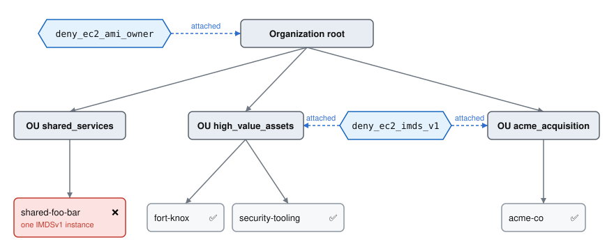

# Headroom

**Generate the AWS SCPs and RCPs your organization already complies with.**

Headroom scans every account in an AWS Organization, records which workloads
violate each guardrail, and writes Terraform only for the Service Control
Policies (SCPs) and Resource Control Policies (RCPs) every reached account
already satisfies, attached at the highest level of the org where that is true.

> **Disclosure:** I am not liable for your outage. Review every generated policy before you apply it.

[](https://www.python.org/downloads/)
[](LICENSE)
[](tests/)

[](spec/product.md#the-safety-promise)

*One violating account blocks a policy from root. Headroom attaches it to every
OU that is clean instead, and to nothing that is not.*

## Highlights

- **Safe by construction.** A policy is attached only where every account it
  reaches has zero violations. One violating account anywhere in an OU's
  subtree disqualifies the whole subtree.
- **Placed as high as possible.** Root first, then each OU, then single
  accounts. The result is the fewest attachments that still cover every clean
  account.
- **Allowlists from observation.** The approved IAM users, AMI owners, and
  third-party accounts are the ones the workloads already use. Nothing is
  invented, and an empty observation never becomes a statement that denies
  everything.
- **Terraform you review.** Headroom writes `.tf` files and attaches nothing.
  Every file it owns opens with `# Code generated by Headroom. DO NOT EDIT.`,
  and each run reconciles the output directories to the current state.
- **Fails loud.** An account, region, or policy that could not be read aborts
  the run. Absence of evidence is never reported as zero findings.

The first three are the [safety promise](spec/product.md#the-safety-promise)
in brief and the last two are [global invariants](spec/invariants.md).

## Why

AWS lets you write a guardrail as a Service Control Policy or a Resource
Control Policy, but it cannot tell you what attaching one would break. The only
way to find out is to attach it. Headroom answers the
question per check: which accounts already comply, where the policy can attach
today, and exactly which resources stand in the way of the rest. The product
specification states [the safety promise](spec/product.md#the-safety-promise)
in full.

## What a run produces

One command, three artifacts, in this order:

1. **Result JSON**, one file per check per account, recording every violation,
   exemption, and compliant resource.
2. **Placement recommendations**, printed to the console.
3. **Terraform**, one module call per target, reconciled to this run.

[](documentation/EXAMPLES.md#console-output)

The root module call those recommendations produce, abridged to the one
statement the render's first block enables:

```hcl
# Code generated by Headroom. DO NOT EDIT.
module "scps_root" {
  source = "../modules/scps"
  target_id = local.root_ou_id

  deny_ec2_ami_owner = true
  ec2_allowed_ami_owners = [
    "333333333333",
    "amazon",
  ]
}
```

The full file renders every other registered check as `false`, each under a
comment saying why: enforced above, enforced below at named targets, blocked
by named accounts, never scanned, or switched off because its allowlist came
back empty. The [SCP module call](documentation/EXAMPLES.md#scp-module-call)
in the examples shows the comments in place.

The root block covers two accounts that were never analyzed. An account you
[skip](documentation/SETUP.md#skipping-accounts), or one that is not ACTIVE,
produces no evidence and does not restrain placement, so the guarantee holds
over the accounts that were scanned. The
[Terraform and JSON](documentation/EXAMPLES.md) from that run follow the
console output. No organization to point it at?
[`test_environment/`](test_environment/README.md) describes a four-account demo
org with deliberate violations for 14 of the 16 checks; its README says what
applies today.

## How it works

```
Security analysis account
    ├─> Management account      read the organization tree, once
    ├─> Member account 1        run every check in every enabled region
    ├─> Member account 2        run every check in every enabled region
    └─> Member account N        run every check in every enabled region
```

1. Assume `OrgAndAccountInfoReader` in the management account and read the
   organization once.
2. Assume `Headroom` in every ACTIVE member account and run every registered
   check, 16 accounts at a time.
3. Walk the tree per check: root if every account is clean, otherwise each OU
   whose whole subtree is clean, otherwise each clean account on its own.
4. Render one Terraform module call per target, carrying the allowlist observed
   under it, then reconcile the output directories.

[Architecture specification](spec/architecture/overview.md).
[Tuning concurrency](documentation/SETUP.md#tuning-max_account_workers).

## Checks

16 checks ship today. Each name links to its specification, which carries
the policy statement, the decision table, and the acceptance scenarios.

| Check | Denies | Allowlist drawn from |
|---|---|---|
| [`deny_ec2_ami_owner`](spec/checks/scps/deny_ec2_ami_owner.md) | An EC2 launch from an AMI whose owner the organization does not already use | AMI owners in use |
| [`deny_ec2_imds_hop_limit`](spec/checks/scps/deny_ec2_imds_hop_limit.md) | An EC2 launch whose IMDS hop limit is above 1 | — |
| [`deny_ec2_imds_v1`](spec/checks/scps/deny_ec2_imds_v1.md) | An EC2 launch that leaves the instance answering IMDSv1 | — |
| [`deny_ec2_public_ip`](spec/checks/scps/deny_ec2_public_ip.md) | An EC2 launch that assigns a public IP | — |
| [`deny_eks_create_cluster_without_tag`](spec/checks/scps/deny_eks_create_cluster_without_tag.md) | An EKS cluster created without the `PavedRoad=true` tag | — |
| [`deny_iam_saml_provider_not_aws_sso`](spec/checks/scps/deny_iam_saml_provider_not_aws_sso.md) | An IAM SAML provider, so federation goes through IAM Identity Center alone | — |
| [`deny_iam_user_creation`](spec/checks/scps/deny_iam_user_creation.md) | A new IAM user, except the users that already exist | IAM users that exist |
| [`deny_lambda_auth_type_none`](spec/checks/scps/deny_lambda_auth_type_none.md) | A Lambda function URL with `NONE` authentication | — |
| [`deny_rds_unencrypted`](spec/checks/scps/deny_rds_unencrypted.md) | An RDS instance or cluster without encryption at rest | — |
| [`deny_ecr_third_party_access`](spec/checks/rcps/deny_ecr_third_party_access.md) | ECR access by any principal outside the organization | Third-party accounts repository policies already grant |
| [`deny_kms_third_party_access`](spec/checks/rcps/deny_kms_third_party_access.md) | KMS access by any principal outside the organization | Third-party accounts key policies already grant |
| [`deny_s3_third_party_access`](spec/checks/rcps/deny_s3_third_party_access.md) | S3 access by any principal outside the organization | Third-party accounts bucket policies already grant |
| [`deny_secrets_manager_third_party_access`](spec/checks/rcps/deny_secrets_manager_third_party_access.md) | Secrets Manager access by any principal outside the organization | Third-party accounts secret policies already grant |
| [`deny_sqs_third_party_access`](spec/checks/rcps/deny_sqs_third_party_access.md) | SQS access by any principal outside the organization | Third-party accounts queue policies already grant |
| [`deny_sts_third_party_assumerole`](spec/checks/rcps/deny_sts_third_party_assumerole.md) | `sts:AssumeRole` by any principal outside the organization | Third-party accounts role trust policies already allow |
| [`deny_service_confused_deputy`](spec/checks/rcps/deny_service_confused_deputy.md) | An AWS service acting for an account outside the organization, on calls that name the account they act for, across the six services above | Source accounts named in service-mediated grants |

The first 9 are SCPs, the last 7 RCPs; the
[check index](spec/checks/index.md) carries the pattern and scope of each.
[`ROADMAP.md`](ROADMAP.md) lists what comes next.

## What Headroom will not do

| It will not | Because |
|---|---|
| Apply Terraform, or attach any policy | Headroom writes files. A human reviews and applies them |
| Remediate a violation | It reports what a policy would break. Fixing that is the workload owner's decision |
| Decide whether a guardrail is worth having | It decides deployability, never desirability |
| Read CloudTrail | Deployability is judged from current resource state. Historical analysis is on the roadmap |

Each is a design decision, stated with its reasoning under
[non-goals](spec/product.md#non-goals).

## Get started

Requirements: Python 3.12 or 3.13, and AWS credentials for the account Headroom
runs from.

1. Deploy two IAM roles: `Headroom` in every account to scan, and
   `OrgAndAccountInfoReader` in the management account. The
   [setup guide](documentation/SETUP.md) lists each role's permissions and
   points at the Terraform that creates them. Accounts that are not ACTIVE are
   skipped, so they need no role.
2. Write `config.yaml`, or copy [`sample_config.yaml`](sample_config.yaml)
   and edit it:

   ```yaml
   management_account_id: '222222222222'
   use_account_name_from_tags: false
   account_tag_layout:
     environment: 'Environment'
     name: 'Name'
     owner: 'Owner'
   ```

3. Install and run:

   ```bash
   git clone https://github.com/discocrayon/Headroom
   cd Headroom
   python -m venv .venv && source .venv/bin/activate
   pip install -r requirements.txt
   python -m headroom --config config.yaml
   ```

By default, results land in `test_environment/headroom_results/` and Terraform
in `test_environment/scps/` and `test_environment/rcps/`. Running from the
management account, skipping accounts, and
[every other option](documentation/SETUP.md#configuration-parameters) are in
the setup guide.

## Documentation

| Document | Covers |
|---|---|
| [Setup guide](documentation/SETUP.md) | Roles, credentials, every config field, what a run leaves behind, the CLI, troubleshooting |
| [Output examples](documentation/EXAMPLES.md) | Console, Terraform, and JSON from one run |
| [Test environment](test_environment/README.md) | A reproducible demo organization: topology, cost, cleanup |
| [Diagrams](documentation/mermaid_diagrams/README.md) | Execution flow, module dependencies, class model, sequences |
| [Specification manifest](spec/README.md) | What Headroom promises, and which document owns which topic |
| [Global invariants](spec/invariants.md) | The rules no subsystem may break |
| [Check specifications](spec/checks/index.md) | One document per check |
| [Adding a check](HOW_TO_ADD_A_CHECK.md) | The authoring runbook |
| [Roadmap](ROADMAP.md) | What comes next |

The specification corpus under `spec/` is normative. Everything else, this file
included, links to it rather than restating it.

## Contributing

[CONTRIBUTING.md](CONTRIBUTING.md) covers the test suite, the quality bar, and
the spec-first rule for a new check.

## License

Apache 2.0. See [LICENSE](LICENSE).
