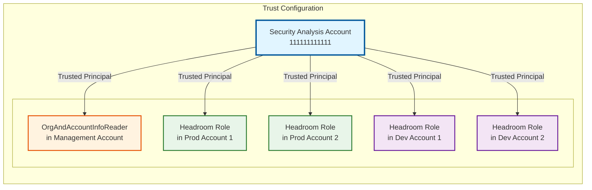
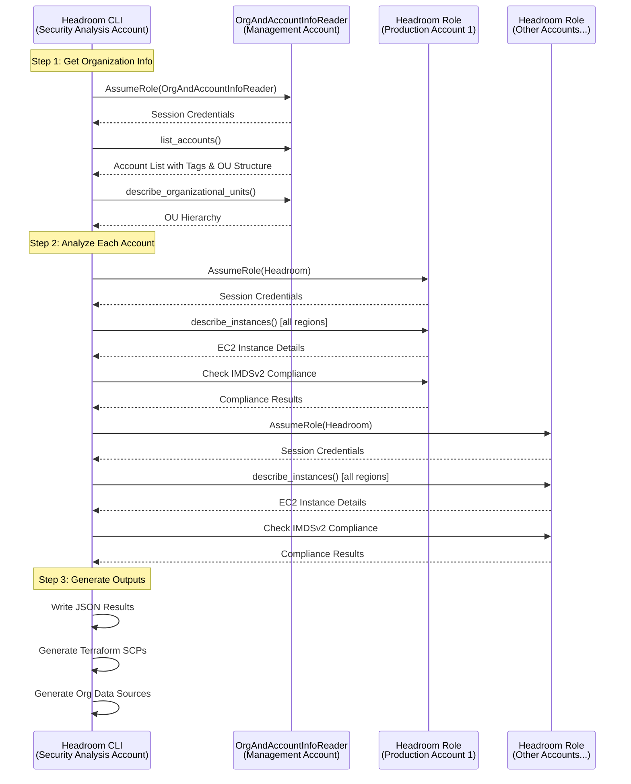

# Architecture

## Trust Model



## Module Structure

```
headroom/
├── aws/           # AWS service integrations
│   ├── ec2.py     # EC2 analysis functions
│   ├── ecr.py     # ECR repository policy analysis
│   ├── eks.py     # EKS analysis functions
│   ├── iam/       # IAM analysis package
│   │   ├── roles.py   # RCP-focused IAM role trust policy analysis
│   │   └── users.py   # SCP-focused IAM user enumeration
│   ├── s3.py      # S3 bucket policy analysis
│   ├── aoss.py    # OpenSearch Serverless policy analysis
│   ├── organization.py  # Organizations API integration
│   ├── rds.py     # RDS analysis functions
│   └── sessions.py      # Session management utilities
├── checks/        # Compliance checks (extensible framework)
│   ├── base.py    # BaseCheck abstract class (Template Method pattern)
│   ├── registry.py      # Check registration and discovery
│   ├── scps/      # Service Control Policy checks
│   │   ├── deny_eks_create_cluster_without_tag.py  # EKS paved road check
│   │   ├── deny_iam_user_creation.py  # IAM user creation check
│   │   ├── deny_imds_v1_ec2.py  # EC2 IMDS v1 check
│   │   └── deny_rds_unencrypted.py  # RDS encryption check
│   └── rcps/      # Resource Control Policy checks
│       ├── deny_deny_sts_third_party_assumerole.py  # Third-party IAM AssumeRole check
│       ├── deny_s3_third_party_access.py  # Third-party S3 bucket access check
│       ├── deny_aoss_third_party_access.py  # Third-party AOSS access check
│       └── deny_ecr_third_party_access.py  # ECR third-party access check
├── terraform/     # Terraform generation
│   ├── generate_org_info.py  # Organization data sources
│   ├── generate_scps.py      # SCP configurations
│   ├── generate_rcps.py      # RCP configurations
│   └── utils.py              # Shared Terraform utilities
├── placement/     # Policy placement logic
│   └── hierarchy.py          # OU hierarchy analysis
├── analysis.py    # Security analysis orchestration
├── config.py      # Configuration models (HeadroomConfig, AccountTagLayout)
├── constants.py   # Shared constants
├── main.py        # Application entry point
├── output.py      # Centralized output handling
├── parse_results.py  # Results processing and recommendations
├── types.py       # Shared data models (OrganizationalUnit, AccountOrgPlacement, etc.)
├── usage.py       # CLI argument parsing and config loading
└── write_results.py  # JSON results writing
```

## Data Flow

1. **Configuration**: Parse CLI args and YAML config
2. **AWS Integration**: Establish cross-account sessions
3. **Analysis**: Execute SCP and RCP compliance checks across accounts
4. **Results Processing**: Analyze compliance and determine SCP/RCP placement
5. **Terraform Generation**: Create deployment configurations with appropriate allowlists

## Execution Flow



## Key Architectural Points

1. **Security Analysis Account**: Central hub where Headroom CLI typically executes
2. **Management Account**: Provides organization structure and account metadata via `OrgAndAccountInfoReader` role
3. **Member Accounts**: Each has a `Headroom` role for resource analysis
4. **Trust Relationship**: All roles trust the Security Analysis Account as their principal
5. **Hub-and-Spoke Pattern**: Tool runs from one central account, accesses other accounts via AssumeRole
6. **Flexible Execution**: Can run from either the security analysis account or from the management account (requires `security_analysis_account_id` configuration)
7. **Data Flow**:
   - Management account → Organization metadata
   - Member accounts → Compliance data
   - Tool → Aggregated results + Terraform configs
