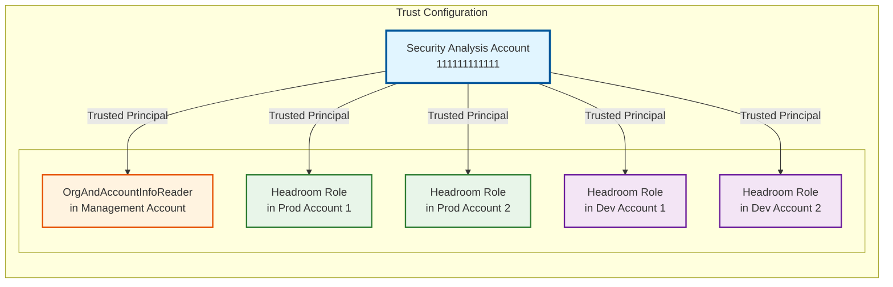
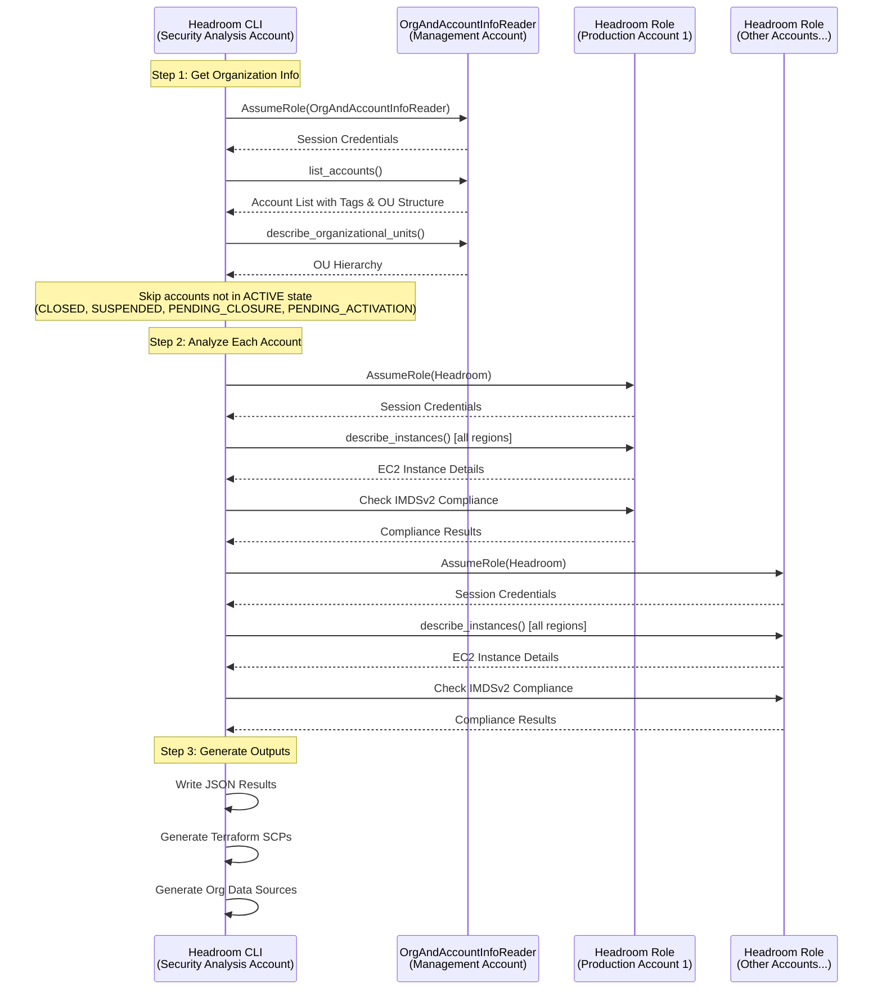

# Architecture

## Trust Model


```mermaid
graph LR
    subgraph "Trust Configuration"
        SA[Security Analysis Account<br/>111111111111]

        subgraph " "
            MGMT_T[OrgAndAccountInfoReader<br/>in Management Account]
            HR1[Headroom Role<br/>in Prod Account 1]
            HR2[Headroom Role<br/>in Prod Account 2]
            HR3[Headroom Role<br/>in Dev Account 1]
            HR4[Headroom Role<br/>in Dev Account 2]
        end

        SA -->|Trusted Principal| MGMT_T
        SA -->|Trusted Principal| HR1
        SA -->|Trusted Principal| HR2
        SA -->|Trusted Principal| HR3
        SA -->|Trusted Principal| HR4

        style SA fill:#e1f5ff,stroke:#01579b,stroke-width:3px
        style MGMT_T fill:#fff3e0,stroke:#e65100,stroke-width:2px
        style HR1 fill:#e8f5e9,stroke:#2e7d32,stroke-width:2px
        style HR2 fill:#e8f5e9,stroke:#2e7d32,stroke-width:2px
        style HR3 fill:#f3e5f5,stroke:#6a1b9a,stroke-width:2px
        style HR4 fill:#f3e5f5,stroke:#6a1b9a,stroke-width:2px
    end
```

## Module Structure

```
headroom/
├── aws/           # AWS service integrations
│   ├── ec2.py     # EC2 analysis functions
│   ├── ecr.py     # ECR repository policy analysis
│   ├── eks.py     # EKS analysis functions
│   ├── helpers.py # Shared AWS helpers (region enumeration, pagination)
│   ├── iam/       # IAM analysis package
│   │   ├── roles.py   # RCP-focused IAM role trust policy analysis
│   │   ├── saml.py    # IAM SAML provider analysis
│   │   └── users.py   # SCP-focused IAM user enumeration
│   ├── kms.py     # KMS key policy analysis
│   ├── lambda_functions.py  # Lambda function analysis
│   ├── organization.py  # Organizations API integration
│   ├── rds.py     # RDS analysis functions
│   ├── s3.py      # S3 bucket policy analysis
│   ├── secretsmanager.py  # Secrets Manager policy analysis
│   ├── sessions.py      # Session management utilities
│   └── sqs.py     # SQS queue policy analysis
├── checks/        # Compliance checks (extensible framework)
│   ├── base.py    # BaseCheck abstract class (Template Method pattern)
│   ├── registry.py      # Check registration and discovery
│   ├── scps/      # Service Control Policy checks
│   │   ├── deny_ec2_ami_owner.py  # EC2 AMI owner check
│   │   ├── deny_ec2_imds_hop_limit.py  # EC2 IMDS hop limit check
│   │   ├── deny_ec2_imds_v1.py  # EC2 IMDS v1 check
│   │   ├── deny_ec2_public_ip.py  # EC2 public IP check
│   │   ├── deny_eks_create_cluster_without_tag.py  # EKS paved road check
│   │   ├── deny_iam_saml_provider_not_aws_sso.py  # IAM SAML provider check
│   │   ├── deny_iam_user_creation.py  # IAM user creation check
│   │   ├── deny_lambda_auth_type_none.py  # Lambda function URL authentication check
│   │   └── deny_rds_unencrypted.py  # RDS encryption check
│   └── rcps/      # Resource Control Policy checks
│       ├── deny_ecr_third_party_access.py  # ECR third-party access check
│       ├── deny_kms_third_party_access.py  # KMS third-party access check
│       ├── deny_s3_third_party_access.py  # S3 third-party access check
│       ├── deny_secrets_manager_third_party_access.py  # Secrets Manager third-party access check
│       ├── deny_sqs_third_party_access.py  # SQS third-party access check
│       └── deny_sts_third_party_assumerole.py  # STS third-party AssumeRole check
├── terraform/     # Terraform generation
│   ├── generate_org_info.py  # Organization data sources
│   ├── generate_scps.py      # SCP configurations
│   ├── generate_rcps.py      # RCP configurations
│   └── utils.py              # Shared Terraform utilities
├── placement/     # Policy placement logic
│   └── hierarchy.py          # OU hierarchy analysis
├── analysis.py    # Security analysis orchestration
├── config.py      # Configuration models (HeadroomConfig, AccountTagLayout)
├── constants.py   # Shared constants
├── main.py        # Application entry point
├── output.py      # Centralized output handling
├── parse_results.py  # Results processing and recommendations
├── types.py       # Shared data models (OrganizationalUnit, AccountOrgPlacement, etc.)
├── usage.py       # CLI argument parsing and config loading
└── write_results.py  # JSON results writing
```

## Data Flow

1. **Configuration**: Parse CLI args and YAML config
2. **AWS Integration**: Establish cross-account sessions
3. **Analysis**: Execute SCP and RCP compliance checks across accounts
4. **Results Processing**: Analyze compliance and determine SCP/RCP placement
5. **Terraform Generation**: Create deployment configurations with appropriate allowlists

## Execution Flow


```mermaid
sequenceDiagram
    participant Tool as Headroom CLI<br/>(Security Analysis Account)
    participant Mgmt as OrgAndAccountInfoReader<br/>(Management Account)
    participant Prod1 as Headroom Role<br/>(Production Account 1)
    participant ProdN as Headroom Role<br/>(Other Accounts...)

    Note over Tool: Step 1: Get Organization Info
    Tool->>Mgmt: AssumeRole(OrgAndAccountInfoReader)
    Mgmt-->>Tool: Session Credentials
    Tool->>Mgmt: list_accounts()
    Mgmt-->>Tool: Account List with Tags & OU Structure
    Tool->>Mgmt: describe_organizational_units()
    Mgmt-->>Tool: OU Hierarchy
    Note over Tool: Skip accounts not in ACTIVE state<br/>(CLOSED, SUSPENDED, PENDING_CLOSURE, PENDING_ACTIVATION)

    Note over Tool: Step 2: Analyze Each Account
    Tool->>Prod1: AssumeRole(Headroom)
    Prod1-->>Tool: Session Credentials
    Tool->>Prod1: describe_instances() [all regions]
    Prod1-->>Tool: EC2 Instance Details
    Tool->>Prod1: Check IMDSv2 Compliance
    Prod1-->>Tool: Compliance Results

    Tool->>ProdN: AssumeRole(Headroom)
    ProdN-->>Tool: Session Credentials
    Tool->>ProdN: describe_instances() [all regions]
    ProdN-->>Tool: EC2 Instance Details
    Tool->>ProdN: Check IMDSv2 Compliance
    ProdN-->>Tool: Compliance Results

    Note over Tool: Step 3: Generate Outputs
    Tool->>Tool: Write JSON Results
    Tool->>Tool: Generate Terraform SCPs
    Tool->>Tool: Generate Org Data Sources
```

## Key Architectural Points

1. **Security Analysis Account**: Central hub where Headroom CLI typically executes
2. **Management Account**: Provides organization structure and account metadata via `OrgAndAccountInfoReader` role
3. **Member Accounts**: Each has a `Headroom` role for resource analysis
4. **Trust Relationship**: All roles trust the Security Analysis Account as their principal
5. **Hub-and-Spoke Pattern**: Tool runs from one central account, accesses other accounts via AssumeRole
6. **Flexible Execution**: Can run from either the security analysis account or from the management account (requires `security_analysis_account_id` configuration)
7. **ACTIVE-Only Analysis**: Only accounts in the `ACTIVE` lifecycle state are analyzed. `CLOSED`, `SUSPENDED` and `PENDING_ACTIVATION` accounts reject role assumption, and `PENDING_CLOSURE` accounts are leaving the organization. Read from the `State` field, falling back to the `Status` field that AWS retires on 2026-09-09; an account whose lifecycle state cannot be classified - reporting neither field, or a state AWS added that Headroom does not know - aborts the run rather than being guessed at, and a test asserts the known states still cover the SDK's enum so a new one surfaces in CI. Organization-membership lookups are deliberately **not** filtered, since a closed account stays an organization member and still matches organization-based RCP conditions
8. **Fail-Fast Analysis**: A failure while analyzing any account aborts the entire run; errors are never logged and skipped. A partial run is more dangerous than no run, because the output drives SCP/RCP deployment and an account skipped for a transient error is indistinguishable from one with zero violations. Accounts that genuinely cannot be analyzed are excluded up front by lifecycle state instead
9. **Registry-Driven Policy Wiring**: Every stage between check collection and Terraform generation is driven by the check registry, never by a hardcoded check name. `parse_rcp_result_files` iterates `get_check_names("rcps")` and placement runs once per check, so a registered check cannot be collected and then silently dropped. The one place a new RCP check must be declared by hand is `RCP_TERRAFORM_VARIABLES`, and `test_table_covers_every_registered_rcp_check` fails by name if that entry is missing. This exists because five RCP checks were once collected against every account on every run and rendered as disabled, which is indistinguishable in the output from a check that found nothing
10. **Data Flow**:
   - Management account → Organization metadata
   - Member accounts → Compliance data
   - Tool → Aggregated results + Terraform configs
