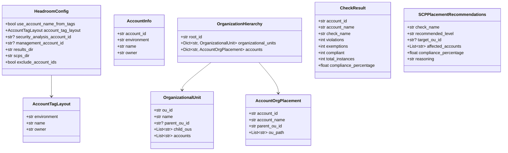

# Class Model Diagram

```mermaid
classDiagram
  class HeadroomConfig {
    +bool use_account_name_from_tags
    +AccountTagLayout account_tag_layout
    +str? security_analysis_account_id
    +str? management_account_id
    +str results_dir
    +str scps_dir
    +bool exclude_account_ids
  }

  class AccountTagLayout {
    +str environment
    +str name
    +str owner
  }

  class AccountInfo {
    +str account_id
    +str environment
    +str name
    +str owner
  }

  class OrganizationalUnit {
    +str ou_id
    +str name
    +str? parent_ou_id
    +List~str~ child_ous
    +List~str~ accounts
  }

  class AccountOrgPlacement {
    +str account_id
    +str account_name
    +str parent_ou_id
    +List~str~ ou_path
  }

  class OrganizationHierarchy {
    +str root_id
    +Dict~str, OrganizationalUnit~ organizational_units
    +Dict~str, AccountOrgPlacement~ accounts
  }

  class CheckResult {
    +str account_id
    +str account_name
    +str check_name
    +int violations
    +int exemptions
    +int compliant
    +int total_instances
    +float compliance_percentage
  }

  class SCPPlacementRecommendations {
    +str check_name
    +str recommended_level
    +str? target_ou_id
    +List~str~ affected_accounts
    +float compliance_percentage
    +str reasoning
  }

  HeadroomConfig --> AccountTagLayout
  OrganizationHierarchy --> OrganizationalUnit
  OrganizationHierarchy --> AccountOrgPlacement
```
