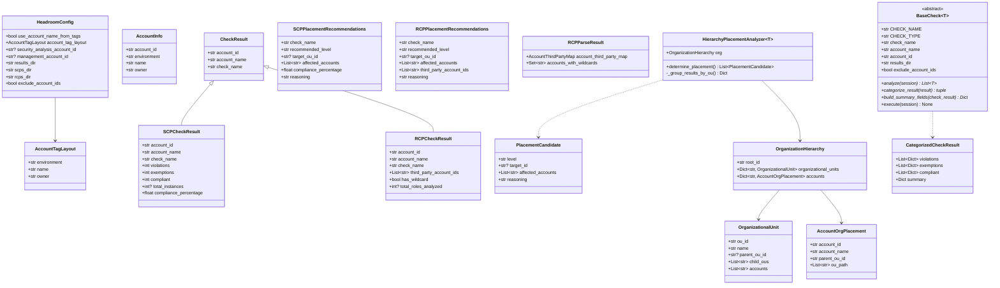

# Class Model Diagram

```mermaid
classDiagram
  class HeadroomConfig {
    +bool use_account_name_from_tags
    +AccountTagLayout account_tag_layout
    +str? security_analysis_account_id
    +str? management_account_id
    +str results_dir
    +str scps_dir
    +str rcps_dir
    +bool exclude_account_ids
  }

  class AccountTagLayout {
    +str environment
    +str name
    +str owner
  }

  class AccountInfo {
    +str account_id
    +str environment
    +str name
    +str owner
  }

  class OrganizationalUnit {
    +str ou_id
    +str name
    +str? parent_ou_id
    +List~str~ child_ous
    +List~str~ accounts
  }

  class AccountOrgPlacement {
    +str account_id
    +str account_name
    +str parent_ou_id
    +List~str~ ou_path
  }

  class OrganizationHierarchy {
    +str root_id
    +Dict~str, OrganizationalUnit~ organizational_units
    +Dict~str, AccountOrgPlacement~ accounts
  }

  class CheckResult {
    +str account_id
    +str account_name
    +str check_name
  }

  class SCPCheckResult {
    +str account_id
    +str account_name
    +str check_name
    +int violations
    +int exemptions
    +int compliant
    +int? total_instances
    +float compliance_percentage
  }

  class RCPCheckResult {
    +str account_id
    +str account_name
    +str check_name
    +List~str~ third_party_account_ids
    +bool has_wildcard
    +int? total_roles_analyzed
  }

  class SCPPlacementRecommendations {
    +str check_name
    +str recommended_level
    +str? target_ou_id
    +List~str~ affected_accounts
    +float compliance_percentage
    +str reasoning
  }

  class RCPPlacementRecommendations {
    +str check_name
    +str recommended_level
    +str? target_ou_id
    +List~str~ affected_accounts
    +List~str~ third_party_account_ids
    +str reasoning
  }

  class RCPParseResult {
    +AccountThirdPartyMap account_third_party_map
    +Set~str~ accounts_with_wildcards
  }

  class BaseCheck~T~ {
    <<abstract>>
    +str CHECK_NAME
    +str CHECK_TYPE
    +str check_name
    +str account_name
    +str account_id
    +str results_dir
    +bool exclude_account_ids
    +analyze(session)* List~T~
    +categorize_result(result)* tuple
    +build_summary_fields(check_result)* Dict
    +execute(session) None
  }

  class CategorizedCheckResult {
    +List~Dict~ violations
    +List~Dict~ exemptions
    +List~Dict~ compliant
    +Dict summary
  }

  class PlacementCandidate {
    +str level
    +str? target_id
    +List~str~ affected_accounts
    +str reasoning
  }

  class HierarchyPlacementAnalyzer~T~ {
    +OrganizationHierarchy org
    +determine_placement() List~PlacementCandidate~
    -_group_results_by_ou() Dict
  }

  HeadroomConfig --> AccountTagLayout
  OrganizationHierarchy --> OrganizationalUnit
  OrganizationHierarchy --> AccountOrgPlacement
  CheckResult <|-- SCPCheckResult
  CheckResult <|-- RCPCheckResult
  BaseCheck ..> CategorizedCheckResult
  HierarchyPlacementAnalyzer ..> PlacementCandidate
  HierarchyPlacementAnalyzer --> OrganizationHierarchy
```
