# Class Model Diagram

Field lists are read from the dataclasses themselves. Most of these live in
`headroom/types.py`; four do not, and the exceptions are marked in the diagram:
`CategorizedCheckResult` is defined in `headroom/checks/base.py`,
`CheckDefinition` and `Allowlist` in `headroom/checks/registry.py`, and
`PlacementCandidate` in `headroom/placement/hierarchy.py`.

```mermaid
classDiagram
  class HeadroomConfig {
    +str? management_account_id
    +str? security_analysis_account_id
    +bool exclude_account_ids
    +List~str~ skip_account_ids
    +bool use_account_name_from_tags
    +AccountTagLayout account_tag_layout
    +str results_dir
    +str scps_dir
    +str rcps_dir
  }

  class AccountTagLayout {
    +str environment
    +str name
    +str owner
  }

  class AccountInfo {
    +str account_id
    +str environment
    +str name
    +str owner
  }

  class OrganizationalUnit {
    +str ou_id
    +str name
    +str? parent_ou_id
    +List~str~ child_ous
    +List~str~ accounts
  }

  class AccountOrgPlacement {
    +str account_id
    +str account_name
    +str parent_ou_id
    +List~str~ ou_path
  }

  class OrganizationHierarchy {
    +str root_id
    +Dict~str, OrganizationalUnit~ organizational_units
    +Dict~str, AccountOrgPlacement~ accounts
  }

  class OrganizationSnapshot {
    +str organization_id
    +FrozenSet~str~ member_account_ids
    +Tuple~AccountInfo~ analyzable_accounts
    +OrganizationHierarchy hierarchy
  }

  class CheckResult {
    +str account_id
    +str account_name
    +str check_name
  }

  class SCPCheckResult {
    +str account_id
    +str account_name
    +str check_name
    +int violations
    +int exemptions
    +int compliant
    +float compliance_percentage
    +int? total_instances
    +List~str~? allowlist_values
  }

  class RCPCheckResult {
    +str account_id
    +str account_name
    +str check_name
    +List~str~ third_party_account_ids
    +bool blocks_rcp
  }

  class CheckCoverage {
    +FrozenSet~str~ analyzed_accounts
    +FrozenSet~str~ unsafe_accounts
  }

  class SCPPlacementRecommendations {
    +str check_name
    +str recommended_level
    +str? target_ou_id
    +List~str~ affected_accounts
    +float compliance_percentage
    +str reasoning
    +List~str~? allowlist_values
  }

  class RCPPlacementRecommendations {
    +str check_name
    +str recommended_level
    +str? target_ou_id
    +List~str~ affected_accounts
    +List~str~ third_party_account_ids
    +str reasoning
  }

  class RCPCheckParseResult {
    +str check_name
    +AccountThirdPartyMap account_third_party_map
    +Set~str~ accounts_with_blockers
  }

  class BaseCheck~T~ {
    <<abstract>>
    +str CHECK_NAME
    +str CHECK_TYPE
    +str check_name
    +str account_name
    +str account_id
    +str results_dir
    +bool exclude_account_ids
    +analyze(session)* List~T~
    +categorize_result(result)* tuple
    +build_summary_fields(check_result)* Dict
    +_build_results_data(check_result) Dict
    +execute(session) None
  }

  class CategorizedCheckResult {
    <<headroom.checks.base>>
    +List~Dict~ violations
    +List~Dict~ exemptions
    +List~Dict~ compliant
    +Dict summary
  }

  class CheckDefinition {
    <<headroom.checks.registry>>
    +Type~BaseCheck~ check_class
    +str check_name
    +str check_type
    +TerraformSection terraform_section
    +Allowlist? allowlist
  }

  class Allowlist {
    <<headroom.checks.registry>>
    +str summary_key
    +str terraform_variable
    +bool restores_account_ids
    +str? empty_allowlist_comment
  }

  class PlacementCandidate {
    <<headroom.placement.hierarchy>>
    +str level
    +str? target_id
    +List~str~ affected_accounts
    +str reasoning
  }

  class HierarchyPlacementAnalyzer~T~ {
    <<headroom.placement.hierarchy>>
    +OrganizationHierarchy org
    +determine_placement() List~PlacementCandidate~
    -_group_results_by_ou_subtree() Dict
    -_top_level_ou_ids() List~str~
    -_ancestor_ou_ids() List~str~
  }

  HeadroomConfig --> AccountTagLayout
  OrganizationHierarchy --> OrganizationalUnit
  OrganizationHierarchy --> AccountOrgPlacement
  OrganizationSnapshot --> AccountInfo
  OrganizationSnapshot --> OrganizationHierarchy
  CheckResult <|-- SCPCheckResult
  CheckResult <|-- RCPCheckResult
  BaseCheck ..> CategorizedCheckResult
  CheckDefinition --> Allowlist
  CheckDefinition ..> BaseCheck
  HierarchyPlacementAnalyzer ..> PlacementCandidate
  HierarchyPlacementAnalyzer --> OrganizationHierarchy
```

