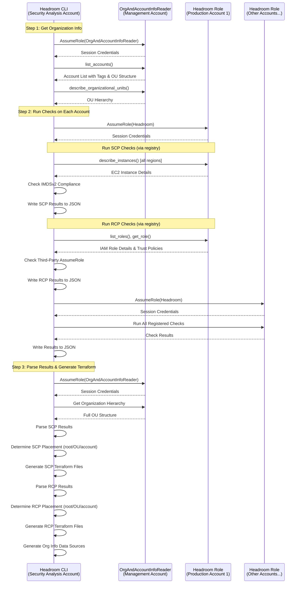

## Execution Flow

**Note:** This diagram shows Headroom running from the security analysis account (recommended). The `security_analysis_account_id` configuration is optional and only needed if running from the management account.

