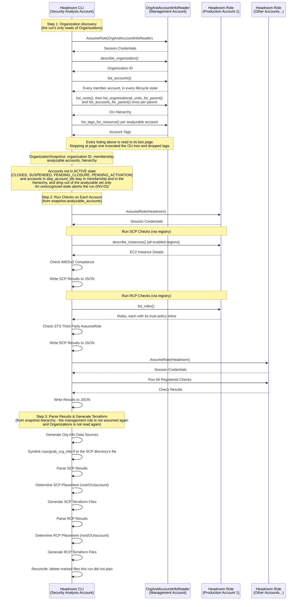

## Execution Flow

**Note:** This diagram shows Headroom running from the security analysis account (recommended). The `security_analysis_account_id` configuration is optional and only needed if running from the management account.

Every AWS call named below is one the code actually makes; the permissions they
need are listed in [`SETUP.md`](../SETUP.md#iam-role-requirements). The
management account is assumed more than once — each organization read builds its
own session — and the two labelled here are the two that read different things.

```mermaid
sequenceDiagram
    participant Tool as Headroom CLI<br/>(Security Analysis Account)
    participant Mgmt as OrgAndAccountInfoReader<br/>(Management Account)
    participant Prod1 as Headroom Role<br/>(Production Account 1)
    participant ProdN as Headroom Role<br/>(Other Accounts...)

    Note over Tool: Step 1: Organization discovery<br/>(the run's only reads of Organizations)
    Tool->>Mgmt: AssumeRole(OrgAndAccountInfoReader)
    Mgmt-->>Tool: Session Credentials
    Tool->>Mgmt: describe_organization()
    Mgmt-->>Tool: Organization ID
    Tool->>Mgmt: list_accounts()
    Mgmt-->>Tool: Every member account, in every lifecycle state
    Tool->>Mgmt: list_roots(), then list_organizational_units_for_parent()<br/>and list_accounts_for_parent() once per parent
    Mgmt-->>Tool: OU Hierarchy
    Tool->>Mgmt: list_tags_for_resource() per analyzable account
    Mgmt-->>Tool: Account Tags
    Note over Tool,Mgmt: Every listing above is read to its last page.<br/>Stopping at page one truncated the OU tree and dropped tags.
    Note over Tool: OrganizationSnapshot: organization ID, membership,<br/>analyzable accounts, hierarchy
    Note over Tool: Accounts not in ACTIVE state<br/>(CLOSED, SUSPENDED, PENDING_CLOSURE, PENDING_ACTIVATION)<br/>and accounts in skip_account_ids stay in membership and in the<br/>hierarchy, and drop out of the analyzable set only<br/>An unrecognized state aborts the run (INV-03)

    Note over Tool: Step 2: Run Checks on Each Account<br/>(from snapshot.analyzable_accounts)
    Tool->>Prod1: AssumeRole(Headroom)
    Prod1-->>Tool: Session Credentials

    Note over Tool,Prod1: Run SCP Checks (via registry)
    Tool->>Prod1: describe_instances() [all enabled regions]
    Prod1-->>Tool: EC2 Instance Details
    Tool->>Tool: Check IMDSv2 Compliance
    Tool->>Tool: Write SCP Results to JSON

    Note over Tool,Prod1: Run RCP Checks (via registry)
    Tool->>Prod1: list_roles()
    Prod1-->>Tool: Roles, each with its trust policy inline
    Tool->>Tool: Check STS Third-Party AssumeRole
    Tool->>Tool: Write RCP Results to JSON

    Tool->>ProdN: AssumeRole(Headroom)
    ProdN-->>Tool: Session Credentials
    Tool->>ProdN: Run All Registered Checks
    ProdN-->>Tool: Check Results
    Tool->>Tool: Write Results to JSON

    Note over Tool: Step 3: Parse Results & Generate Terraform<br/>(from snapshot.hierarchy - the management role is not assumed again<br/>and Organizations is not read again)

    Tool->>Tool: Generate Org Info Data Sources
    Tool->>Tool: Symlink rcps/grab_org_info.tf to the SCP directory's file

    Tool->>Tool: Parse SCP Results
    Tool->>Tool: Determine SCP Placement (root/OU/account)
    Tool->>Tool: Generate SCP Terraform Files

    Tool->>Tool: Parse RCP Results
    Tool->>Tool: Determine RCP Placement (root/OU/account)
    Tool->>Tool: Generate RCP Terraform Files

    Tool->>Tool: Reconcile: delete marked files this run did not plan
```

Two orderings in Step 3 are load-bearing. The organization data sources and the
symlink are written before either workflow runs, because both workflows'
generated modules reference them. Reconciliation runs last and only if both
workflows succeeded — a raise anywhere above it leaves the previous run's output
whole rather than deleting files this run never got as far as planning.
