# Module Dependency Diagram

Every edge is an actual `import` between two modules under `headroom/`, read
from the source. Ten modules have no outgoing edge — `config`, `constants`,
`enums`, `types`, `utils`, `output`, `aws.helpers`, `aws.sessions`,
`aws.iam.users`, and `aws.iam.saml_providers`. They import nothing from the
package and are the leaves the rest is built on.

A package's `__init__.py` re-exports through an ordinary `from .module import`,
so it earns an edge on the same rule as anything else: `headroom.aws`,
`headroom.aws.iam`, `headroom.placement`, and `headroom.terraform` appear as
sources for that reason and no other. Four earn none. `headroom/__init__.py`,
`headroom/checks/rcps/__init__.py` and `headroom/checks/scps/__init__.py` are
empty files, and `headroom/checks/__init__.py` re-exports nothing - it walks
`scps/` and `rcps/` through `importlib` so each `@register_check` runs.

Sixteen checks are registered, nine under `checks/scps/` and seven under
`checks/rcps/`. Drawing all sixteen would repeat one shape sixteen times, so two
stand in for the rest: every check imports `checks.base`, `checks.registry`,
`constants`, and `enums`, most import `types`, and each imports the one
`headroom.aws` analyzer it reads its evidence from.

```mermaid
graph TD
  headroom.__main__ --> headroom.main

  headroom.main --> headroom.log_context
  headroom.main --> headroom.usage
  headroom.main --> headroom.config
  headroom.main --> headroom.analysis
  headroom.main --> headroom.parse_results
  headroom.main --> headroom.terraform.plan
  headroom.main --> headroom.terraform.apply
  headroom.main --> headroom.terraform.generate_rcps
  headroom.main --> headroom.aws.organization
  headroom.main --> headroom.aws.organization_snapshot
  headroom.main --> headroom.log_context
  headroom.main --> headroom.types
  headroom.main --> headroom.output

  headroom.analysis --> headroom.config
  headroom.analysis --> headroom.log_context
  headroom.analysis --> headroom.types
  headroom.analysis --> headroom.checks.registry
  headroom.analysis --> headroom.write_results
  headroom.analysis --> headroom.aws.sessions
  headroom.analysis --> headroom.utils

  headroom.checks.registry --> headroom.checks.base
  headroom.checks.registry --> headroom.enums

  headroom.checks.base --> headroom.write_results
  headroom.checks.base --> headroom.output
  headroom.checks.base --> headroom.types
  headroom.checks.base --> headroom.utils
  headroom.checks.base --> headroom.enums

  headroom.checks.scps.deny_ec2_imds_v1 --> headroom.checks.base
  headroom.checks.scps.deny_ec2_imds_v1 --> headroom.checks.registry
  headroom.checks.scps.deny_ec2_imds_v1 --> headroom.aws.ec2
  headroom.checks.scps.deny_ec2_imds_v1 --> headroom.constants
  headroom.checks.scps.deny_ec2_imds_v1 --> headroom.enums
  headroom.checks.scps.deny_ec2_imds_v1 --> headroom.types

  headroom.checks.rcps.deny_sts_third_party_assumerole --> headroom.checks.base
  headroom.checks.rcps.deny_sts_third_party_assumerole --> headroom.checks.registry
  headroom.checks.rcps.deny_sts_third_party_assumerole --> headroom.aws.iam.roles
  headroom.checks.rcps.deny_sts_third_party_assumerole --> headroom.constants
  headroom.checks.rcps.deny_sts_third_party_assumerole --> headroom.enums
  headroom.checks.rcps.deny_sts_third_party_assumerole --> headroom.types

  headroom.parse_results --> headroom.config
  headroom.parse_results --> headroom.aws.organization
  headroom.parse_results --> headroom.checks.registry
  headroom.parse_results --> headroom.placement
  headroom.parse_results --> headroom.types
  headroom.parse_results --> headroom.constants
  headroom.parse_results --> headroom.output
  headroom.parse_results --> headroom.utils

  headroom.placement --> headroom.placement.hierarchy
  headroom.placement.hierarchy --> headroom.types

  headroom.terraform --> headroom.terraform.apply
  headroom.terraform --> headroom.terraform.generate_org_info
  headroom.terraform --> headroom.terraform.generate_rcps
  headroom.terraform --> headroom.terraform.generate_scps
  headroom.terraform --> headroom.terraform.plan
  headroom.terraform --> headroom.terraform.utils

  headroom.terraform.plan --> headroom.terraform.generate_org_info
  headroom.terraform.plan --> headroom.terraform.generate_scps
  headroom.terraform.plan --> headroom.terraform.generate_rcps
  headroom.terraform.plan --> headroom.terraform.models
  headroom.terraform.plan --> headroom.terraform.utils
  headroom.terraform.plan --> headroom.config
  headroom.terraform.plan --> headroom.constants
  headroom.terraform.plan --> headroom.types

  headroom.terraform.apply --> headroom.terraform.plan
  headroom.terraform.apply --> headroom.constants

  headroom.terraform.generate_scps --> headroom.terraform.models
  headroom.terraform.generate_scps --> headroom.terraform.parameters
  headroom.terraform.generate_scps --> headroom.terraform.utils
  headroom.terraform.generate_scps --> headroom.checks.registry
  headroom.terraform.generate_scps --> headroom.types
  headroom.terraform.generate_scps --> headroom.enums

  headroom.terraform.generate_rcps --> headroom.checks.registry
  headroom.terraform.generate_rcps --> headroom.parse_results
  headroom.terraform.generate_rcps --> headroom.placement
  headroom.terraform.generate_rcps --> headroom.placement.hierarchy
  headroom.terraform.generate_rcps --> headroom.terraform.models
  headroom.terraform.generate_rcps --> headroom.terraform.parameters
  headroom.terraform.generate_rcps --> headroom.terraform.utils
  headroom.terraform.generate_rcps --> headroom.write_results
  headroom.terraform.generate_rcps --> headroom.types
  headroom.terraform.generate_rcps --> headroom.utils

  headroom.terraform.parameters --> headroom.terraform.models
  headroom.terraform.parameters --> headroom.terraform.utils
  headroom.terraform.parameters --> headroom.checks.registry
  headroom.terraform.parameters --> headroom.enums
  headroom.terraform.parameters --> headroom.types
  headroom.terraform.parameters --> headroom.utils

  headroom.terraform.generate_org_info --> headroom.terraform.utils
  headroom.terraform.generate_org_info --> headroom.types
  headroom.terraform.generate_org_info --> headroom.constants

  headroom.terraform.utils --> headroom.terraform.models
  headroom.terraform.utils --> headroom.types
  headroom.terraform.utils --> headroom.utils
  headroom.terraform.models --> headroom.constants

  headroom.aws.organization --> headroom.aws.helpers
  headroom.aws.organization_snapshot --> headroom.aws.helpers
  headroom.aws.organization_snapshot --> headroom.aws.organization
  headroom.aws.organization_snapshot --> headroom.config
  headroom.aws.organization_snapshot --> headroom.types

  headroom.aws.organization --> headroom.types
  headroom.aws.organization --> headroom.utils

  headroom.aws.ec2 --> headroom.aws.helpers
  headroom.aws.iam.roles --> headroom.aws.helpers
  headroom.aws.ec2 --> headroom.constants
  headroom.aws.ec2 --> headroom.enums
  headroom.aws.eks --> headroom.aws.helpers
  headroom.aws.eks --> headroom.constants
  headroom.aws.rds --> headroom.aws.helpers
  headroom.aws.lambda_functions --> headroom.aws.helpers

  headroom.aws.ecr --> headroom.aws.helpers
  headroom.aws.ecr --> headroom.aws.policy_documents
  headroom.aws.ecr --> headroom.types
  headroom.aws.kms --> headroom.aws.helpers
  headroom.aws.kms --> headroom.aws.policy_documents
  headroom.aws.kms --> headroom.constants
  headroom.aws.kms --> headroom.types
  headroom.aws.s3 --> headroom.aws.helpers
  headroom.aws.s3 --> headroom.aws.policy_documents
  headroom.aws.s3 --> headroom.types
  headroom.aws.secretsmanager --> headroom.aws.helpers
  headroom.aws.secretsmanager --> headroom.aws.policy_documents
  headroom.aws.secretsmanager --> headroom.types
  headroom.aws.sqs --> headroom.aws.helpers
  headroom.aws.sqs --> headroom.aws.policy_documents

  headroom.aws --> headroom.aws.iam
  headroom.aws.iam --> headroom.aws.iam.roles
  headroom.aws.iam --> headroom.aws.iam.users
  headroom.aws.iam --> headroom.aws.iam.saml_providers
  headroom.aws.iam.roles --> headroom.aws.policy_documents

  headroom.aws.policy_documents --> headroom.constants

  headroom.write_results --> headroom.constants
  headroom.write_results --> headroom.utils

  headroom.usage --> headroom.config
```

`aws.policy_documents` is the shared edge worth noticing: `ecr`, `kms`, `s3`,
`secretsmanager`, `sqs`, and `iam.roles` all read a policy statement through it,
which is why a change to how a statement is read is a change to all six.
[`spec/contracts/policy-model.md`](../../spec/contracts/policy-model.md) owns
that rule.
