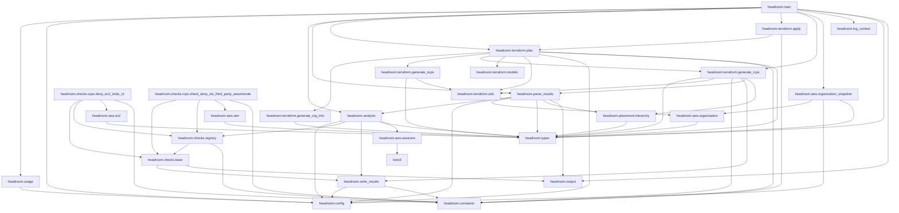

# Module Dependency Diagram

```mermaid
graph TD
  headroom.main --> headroom.usage
  headroom.main --> headroom.config
  headroom.main --> headroom.analysis
  headroom.main --> headroom.parse_results
  headroom.main --> headroom.terraform.plan
  headroom.main --> headroom.terraform.apply
  headroom.main --> headroom.terraform.generate_rcps
  headroom.main --> headroom.aws.organization_snapshot
  headroom.main --> headroom.log_context
  headroom.main --> headroom.types
  headroom.main --> headroom.output

  headroom.analysis --> headroom.config
  headroom.analysis --> headroom.checks.registry
  headroom.analysis --> headroom.write_results
  headroom.analysis --> headroom.aws.sessions
  headroom.analysis --> headroom.types

  headroom.checks.registry --> headroom.checks.base
  headroom.checks.registry --> headroom.constants

  headroom.checks.base --> headroom.write_results
  headroom.checks.base --> headroom.output

  headroom.checks.scps.deny_ec2_imds_v1 --> headroom.checks.base
  headroom.checks.scps.deny_ec2_imds_v1 --> headroom.checks.registry
  headroom.checks.scps.deny_ec2_imds_v1 --> headroom.aws.ec2
  headroom.checks.scps.deny_ec2_imds_v1 --> headroom.constants

  headroom.checks.rcps.check_deny_sts_third_party_assumerole --> headroom.checks.base
  headroom.checks.rcps.check_deny_sts_third_party_assumerole --> headroom.checks.registry
  headroom.checks.rcps.check_deny_sts_third_party_assumerole --> headroom.aws.iam
  headroom.checks.rcps.check_deny_sts_third_party_assumerole --> headroom.constants

  headroom.parse_results --> headroom.analysis
  headroom.parse_results --> headroom.config
  headroom.parse_results --> headroom.aws.organization
  headroom.parse_results --> headroom.types
  headroom.parse_results --> headroom.placement.hierarchy
  headroom.parse_results --> headroom.output

  headroom.placement.hierarchy --> headroom.types

  headroom.terraform.plan --> headroom.terraform.generate_org_info
  headroom.terraform.plan --> headroom.terraform.generate_scps
  headroom.terraform.plan --> headroom.terraform.generate_rcps
  headroom.terraform.plan --> headroom.terraform.models
  headroom.terraform.plan --> headroom.terraform.utils
  headroom.terraform.plan --> headroom.config
  headroom.terraform.plan --> headroom.constants
  headroom.terraform.plan --> headroom.types

  headroom.terraform.apply --> headroom.terraform.plan
  headroom.terraform.apply --> headroom.constants

  headroom.terraform.generate_scps --> headroom.types
  headroom.terraform.generate_scps --> headroom.terraform.utils

  headroom.terraform.generate_rcps --> headroom.types
  headroom.terraform.generate_rcps --> headroom.terraform.utils
  headroom.terraform.generate_rcps --> headroom.constants
  headroom.terraform.generate_rcps --> headroom.write_results
  headroom.terraform.generate_rcps --> headroom.parse_results
  headroom.terraform.generate_rcps --> headroom.placement.hierarchy

  headroom.terraform.generate_org_info --> headroom.types

  headroom.aws.organization_snapshot --> headroom.aws.organization
  headroom.aws.organization_snapshot --> headroom.config
  headroom.aws.organization_snapshot --> headroom.types

  headroom.aws.organization --> headroom.types
  headroom.aws.ec2 --> headroom.types
  headroom.aws.iam --> headroom.types
  headroom.aws.sessions --> boto3

  headroom.usage --> headroom.config

  headroom.write_results --> headroom.config
  headroom.write_results --> headroom.constants
```
