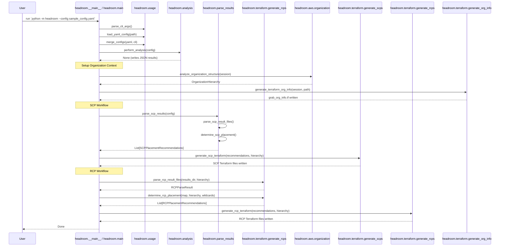
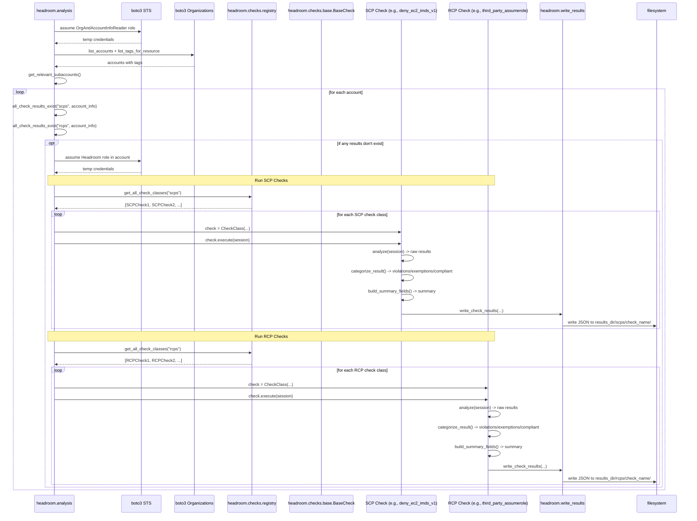
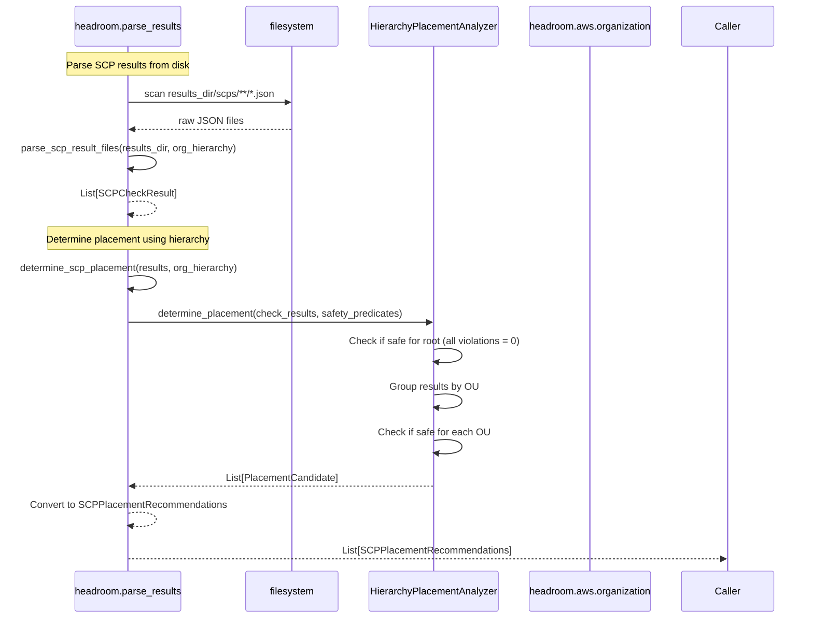
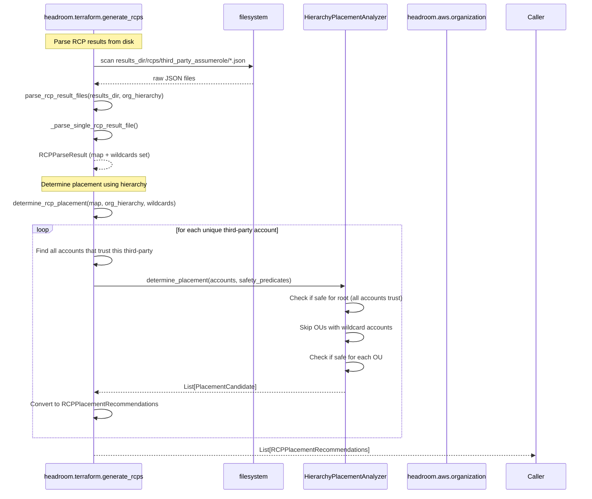

# Sequence Diagrams

## Main CLI Flow

```mermaid
sequenceDiagram
  participant User
  participant CLI as headroom.__main__ / headroom.main
  participant Usage as headroom.usage
  participant Analysis as headroom.analysis
  participant ParseSCP as headroom.parse_results
  participant ParseRCP as headroom.terraform.generate_rcps
  participant Org as headroom.aws.organization
  participant TFSCP as headroom.terraform.generate_scps
  participant TFRCP as headroom.terraform.generate_rcps
  participant TFOrg as headroom.terraform.generate_org_info

  User->>CLI: run `python -m headroom --config sample_config.yaml`
  CLI->>Usage: parse_cli_args()
  CLI->>Usage: load_yaml_config(path)
  CLI->>Usage: merge_configs(yaml, cli)
  CLI->>Analysis: perform_analysis(config)
  Analysis-->>CLI: None (writes JSON results)

  Note over CLI: Setup Organization Context
  CLI->>Org: analyze_organization_structure(session)
  Org-->>CLI: OrganizationHierarchy
  CLI->>TFOrg: generate_terraform_org_info(session, path)
  TFOrg-->>CLI: grab_org_info.tf written

  Note over CLI: SCP Workflow
  CLI->>ParseSCP: parse_scp_results(config)
  ParseSCP->>ParseSCP: parse_scp_result_files()
  ParseSCP->>ParseSCP: determine_scp_placement()
  ParseSCP-->>CLI: List[SCPPlacementRecommendations]
  CLI->>TFSCP: generate_scp_terraform(recommendations, hierarchy)
  TFSCP-->>CLI: SCP Terraform files written

  Note over CLI: RCP Workflow
  CLI->>ParseRCP: parse_rcp_result_files(results_dir, hierarchy)
  ParseRCP-->>CLI: RCPParseResult
  CLI->>ParseRCP: determine_rcp_placement(map, hierarchy, wildcards)
  ParseRCP-->>CLI: List[RCPPlacementRecommendations]
  CLI->>TFRCP: generate_rcp_terraform(recommendations, hierarchy)
  TFRCP-->>CLI: RCP Terraform files written

  CLI-->>User: Done
```

## Security Analysis: Enumerate Accounts and Run Checks

```mermaid
sequenceDiagram
  participant Analysis as headroom.analysis
  participant STS as boto3 STS
  participant Orgs as boto3 Organizations
  participant Registry as headroom.checks.registry
  participant BaseCheck as headroom.checks.base.BaseCheck
  participant SCPCheck as SCP Check (e.g., deny_ec2_imds_v1)
  participant RCPCheck as RCP Check (e.g., third_party_assumerole)
  participant WriteResults as headroom.write_results
  participant FS as filesystem

  Analysis->>STS: assume OrgAndAccountInfoReader role
  STS-->>Analysis: temp credentials
  Analysis->>Orgs: list_accounts + list_tags_for_resource
  Orgs-->>Analysis: accounts with tags
  Analysis->>Analysis: get_relevant_subaccounts()
  loop for each account
    Analysis->>Analysis: all_check_results_exist("scps", account_info)
    Analysis->>Analysis: all_check_results_exist("rcps", account_info)
    opt if any results don't exist
      Analysis->>STS: assume Headroom role in account
      STS-->>Analysis: temp credentials

      Note over Analysis,RCPCheck: Run SCP Checks
      Analysis->>Registry: get_all_check_classes("scps")
      Registry-->>Analysis: [SCPCheck1, SCPCheck2, ...]
      loop for each SCP check class
        Analysis->>SCPCheck: check = CheckClass(...)
        Analysis->>SCPCheck: check.execute(session)
        SCPCheck->>SCPCheck: analyze(session) -> raw results
        SCPCheck->>SCPCheck: categorize_result() -> violations/exemptions/compliant
        SCPCheck->>SCPCheck: build_summary_fields() -> summary
        SCPCheck->>WriteResults: write_check_results(...)
        WriteResults->>FS: write JSON to results_dir/scps/check_name/
      end

      Note over Analysis,RCPCheck: Run RCP Checks
      Analysis->>Registry: get_all_check_classes("rcps")
      Registry-->>Analysis: [RCPCheck1, RCPCheck2, ...]
      loop for each RCP check class
        Analysis->>RCPCheck: check = CheckClass(...)
        Analysis->>RCPCheck: check.execute(session)
        RCPCheck->>RCPCheck: analyze(session) -> raw results
        RCPCheck->>RCPCheck: categorize_result() -> violations/exemptions/compliant
        RCPCheck->>RCPCheck: build_summary_fields() -> summary
        RCPCheck->>WriteResults: write_check_results(...)
        WriteResults->>FS: write JSON to results_dir/rcps/check_name/
      end
    end
  end
```

## SCP Results Parsing and Placement

```mermaid
sequenceDiagram
  participant Results as headroom.parse_results
  participant FS as filesystem
  participant Hierarchy as HierarchyPlacementAnalyzer
  participant Org as headroom.aws.organization

  Note over Results: Parse SCP results from disk
  Results->>FS: scan results_dir/scps/**/*.json
  FS-->>Results: raw JSON files
  Results->>Results: parse_scp_result_files(results_dir, org_hierarchy)
  Results-->>Results: List[SCPCheckResult]

  Note over Results: Determine placement using hierarchy
  Results->>Results: determine_scp_placement(results, org_hierarchy)
  Results->>Hierarchy: determine_placement(check_results, safety_predicates)
  Hierarchy->>Hierarchy: Check if safe for root (all violations = 0)
  Hierarchy->>Hierarchy: Group results by OU
  Hierarchy->>Hierarchy: Check if safe for each OU
  Hierarchy-->>Results: List[PlacementCandidate]
  Results-->>Results: Convert to SCPPlacementRecommendations
  Results-->>Caller: List[SCPPlacementRecommendations]
```

## RCP Results Parsing and Placement

```mermaid
sequenceDiagram
  participant GenRCP as headroom.terraform.generate_rcps
  participant FS as filesystem
  participant Hierarchy as HierarchyPlacementAnalyzer
  participant Org as headroom.aws.organization

  Note over GenRCP: Parse RCP results from disk
  GenRCP->>FS: scan results_dir/rcps/third_party_assumerole/*.json
  FS-->>GenRCP: raw JSON files
  GenRCP->>GenRCP: parse_rcp_result_files(results_dir, org_hierarchy)
  GenRCP->>GenRCP: _parse_single_rcp_result_file()
  GenRCP-->>GenRCP: RCPParseResult (map + wildcards set)

  Note over GenRCP: Determine placement using hierarchy
  GenRCP->>GenRCP: determine_rcp_placement(map, org_hierarchy, wildcards)
  loop for each unique third-party account
    GenRCP->>GenRCP: Find all accounts that trust this third-party
    GenRCP->>Hierarchy: determine_placement(accounts, safety_predicates)
    Hierarchy->>Hierarchy: Check if safe for root (all accounts trust)
    Hierarchy->>Hierarchy: Skip OUs with wildcard accounts
    Hierarchy->>Hierarchy: Check if safe for each OU
    Hierarchy-->>GenRCP: List[PlacementCandidate]
    GenRCP->>GenRCP: Convert to RCPPlacementRecommendations
  end
  GenRCP-->>Caller: List[RCPPlacementRecommendations]
```
