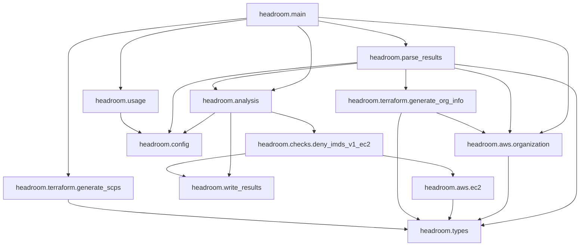

# Module Dependency Diagram

```mermaid
graph TD
  headroom.main --> headroom.usage
  headroom.main --> headroom.analysis
  headroom.main --> headroom.parse_results
  headroom.main --> headroom.terraform.generate_scps
  headroom.main --> headroom.aws.organization

  headroom.analysis --> headroom.config
  headroom.analysis --> headroom.checks.deny_imds_v1_ec2
  headroom.analysis --> headroom.write_results

  headroom.checks.deny_imds_v1_ec2 --> headroom.write_results
  headroom.checks.deny_imds_v1_ec2 --> headroom.aws.ec2

  headroom.parse_results --> headroom.analysis
  headroom.parse_results --> headroom.config
  headroom.parse_results --> headroom.terraform.generate_org_info
  headroom.parse_results --> headroom.aws.organization
  headroom.parse_results --> headroom.types

  headroom.aws.organization --> headroom.types
  headroom.aws.ec2 --> headroom.types

  headroom.terraform.generate_org_info --> headroom.aws.organization
  headroom.terraform.generate_org_info --> headroom.types

  headroom.terraform.generate_scps --> headroom.types

  headroom.usage --> headroom.config
```
