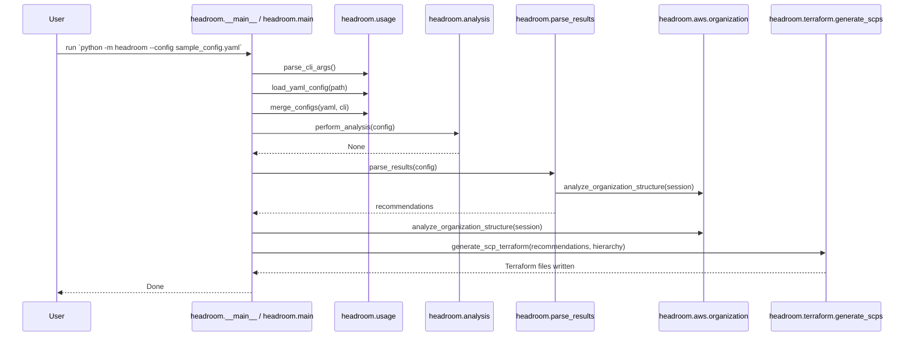
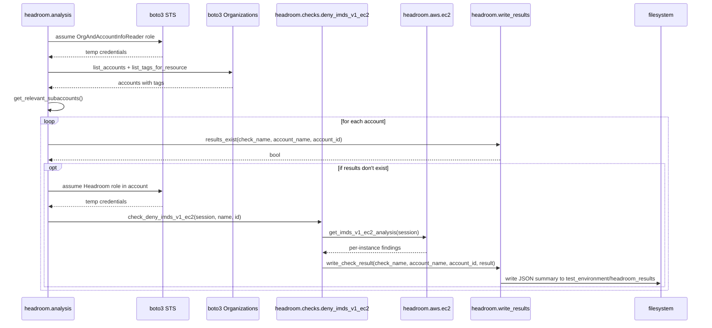
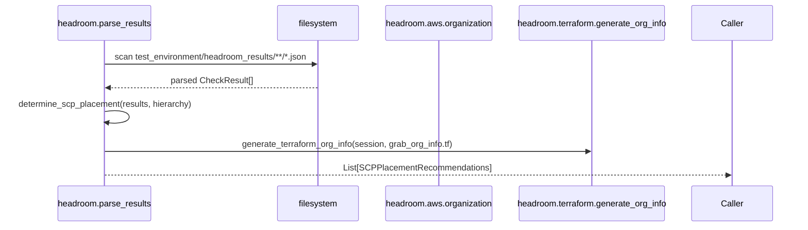

# Sequence Diagrams

## Main CLI Flow

```mermaid
sequenceDiagram
  participant User
  participant CLI as headroom.__main__ / headroom.main
  participant Usage as headroom.usage
  participant Analysis as headroom.analysis
  participant Results as headroom.parse_results
  participant Org as headroom.aws.organization
  participant TF as headroom.terraform.generate_scps

  User->>CLI: run `python -m headroom --config sample_config.yaml`
  CLI->>Usage: parse_cli_args()
  CLI->>Usage: load_yaml_config(path)
  CLI->>Usage: merge_configs(yaml, cli)
  CLI->>Analysis: perform_analysis(config)
  Analysis-->>CLI: None
  CLI->>Results: parse_results(config)
  Results->>Org: analyze_organization_structure(session)
  Results-->>CLI: recommendations
  CLI->>Org: analyze_organization_structure(session)
  CLI->>TF: generate_scp_terraform(recommendations, hierarchy)
  TF-->>CLI: Terraform files written
  CLI-->>User: Done
```

## Security Analysis: Enumerate Accounts and Run Checks

```mermaid
sequenceDiagram
  participant Analysis as headroom.analysis
  participant STS as boto3 STS
  participant Orgs as boto3 Organizations
  participant Checks as headroom.checks.deny_imds_v1_ec2
  participant EC2 as headroom.aws.ec2
  participant WriteResults as headroom.write_results
  participant FS as filesystem

  Analysis->>STS: assume OrgAndAccountInfoReader role
  STS-->>Analysis: temp credentials
  Analysis->>Orgs: list_accounts + list_tags_for_resource
  Orgs-->>Analysis: accounts with tags
  Analysis->>Analysis: get_relevant_subaccounts()
  loop for each account
    Analysis->>WriteResults: results_exist(check_name, account_name, account_id)
    WriteResults-->>Analysis: bool
    opt if results don't exist
      Analysis->>STS: assume Headroom role in account
      STS-->>Analysis: temp credentials
      Analysis->>Checks: check_deny_imds_v1_ec2(session, name, id)
      Checks->>EC2: get_imds_v1_ec2_analysis(session)
      EC2-->>Checks: per-instance findings
      Checks->>WriteResults: write_check_result(check_name, account_name, account_id, result)
      WriteResults->>FS: write JSON summary to test_environment/headroom_results
    end
  end
```

## Results Parsing and SCP Placement

```mermaid
sequenceDiagram
  participant Results as headroom.parse_results
  participant FS as filesystem
  participant Orgs as headroom.aws.organization
  participant TFOrg as headroom.terraform.generate_org_info

  Results->>FS: scan test_environment/headroom_results/**/*.json
  FS-->>Results: parsed CheckResult[]
  Results->>Results: determine_scp_placement(results, hierarchy)
  Results->>TFOrg: generate_terraform_org_info(session, grab_org_info.tf)
  Results-->>Caller: List[SCPPlacementRecommendations]
```
